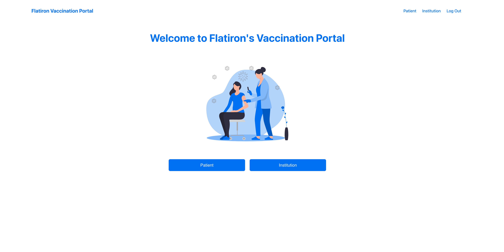
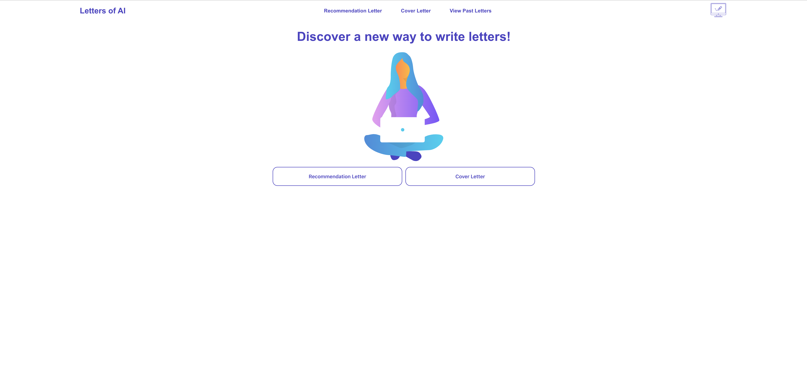

<!--  -->

<h1 align="center">Hi 👋, I'm Kyushik!</h1>

  <!--  -->
  
  
  <!--  -->

<h3 align="left">I'm a full stack web developer based in New York, NY.</h3>

> I can make an impact in every core aspect of the product development process. I have extensive experience defining business value, discovering user needs, designing hi-fidelity wireframes, and developing full-stack applications.

- 🌱 I’m currently developing my skills in **Next.js, TypeScript, and Prisma ORM**
- 📫 How to reach me **pwkn95@gmail.com**
- ⚡ Fun fact, **before software engineering, I had experience in product sales and earned a Master of Fine Arts degree in UX/Innovation design!**
   

<h3 align="left">Languages and Tools:</h3>

 
  

    
    
    
    
    
    
    
    
    
    
    

 

<h2>Projects</h2>

<table>
      <tr>
        <td width="50%">
          <h3 align="center">Art Archive</h3>
          

             
		
		<!--  -->
            

		Digitally store and manage your collection of artworks!
            

          

        </td>
	<td width="50%">
          <h3 align="center">Vaccine</h3>
          

            
		
		<!--  -->
            

            An electronic healthcare record system for vaccine information.
            

          

        </td>
    </tr>
          <tr>
        <td width="50%">
          <h3 align="center">Letters of AI</h3>
          

             
		
		<!--  -->
            

		Easily generate high quality cover letters and letters of recs with the help of AI. 
            

          

        </td>

  </tr>
</table>

<!--
**pwknam/pwknam** is a ✨ _special_ ✨ repository because its `README.md` (this file) appears on your GitHub profile.

Here are some ideas to get you started:

- 🔭 I’m currently working on ...
- 🌱 I’m currently learning ...
- 👯 I’m looking to collaborate on ...
- 🤔 I’m looking for help with ...
- 💬 Ask me about ...
- 📫 How to reach me: ...
- 😄 Pronouns: ...
- ⚡ Fun fact: ...
-->
